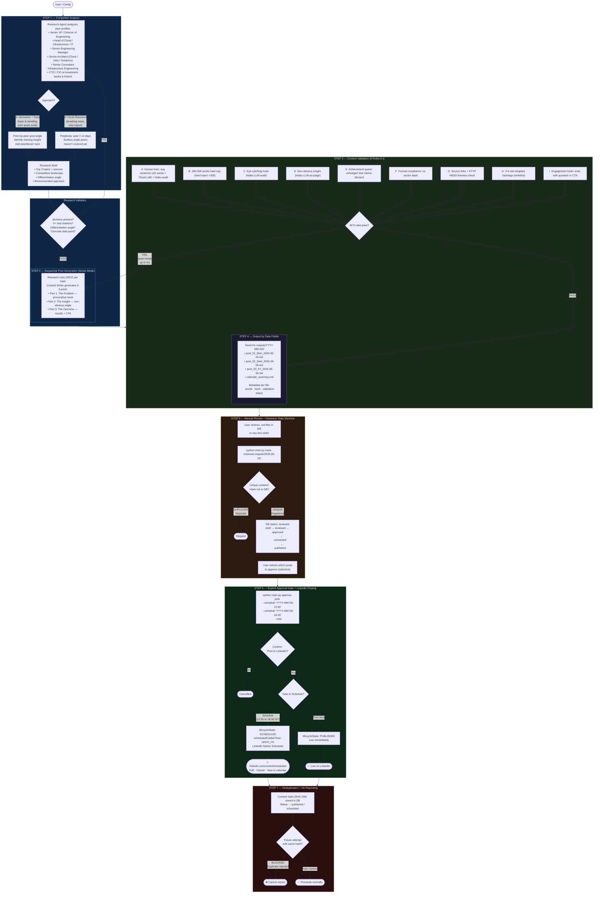

# LinkedIn Post Agent — Full Workflow (7 Steps)

## Pipeline Diagram



---

## Step-by-Step Reference

| Step | What Happens | Command |
|------|-------------|---------|
| **1** | Competitor analysis of senior leadership roles (SVP/Director/Head of Cloud/Infra/IT/Architect) | Auto — runs during generation |
| **1A** | Approach A: take trending peer angle + add non-obvious practitioner twist | Config: `approach: A` |
| **1B** | Approach B: fresh Perplexity research — angle peers haven't covered | Config: `approach: B` |
| **2** | Series: research once, generate 3 connected posts (Problem → Insight → Outcome) | `series_mode.enabled: true` |
| **3** | 9 validation rules A-I: human tone (readability) · words · hook · non-obvious insight · achievement guard · format · source liveness · hashtags · engagement CTA | Auto — runs after each generation |
| **4** | Output saved to `outputs/YYYY-MM-DD/` with `calendar_summary.md` | Auto — runs during generation |
| **5** | Manual review of .md files → `mark-reviewed` registers in DB, dedup check | `python main.py mark-reviewed outputs/2026-05-23/` |
| **6** | Explicit approval gate → LinkedIn native scheduler (12:30 or 18:30 IST) | `python main.py approve-post <file> --schedule "2026-05-26 12:30"` |
| **7** | Content hash blocks reposting — same post cannot be scheduled or published twice | Automatic — enforced in `approve-post` |

---

## Validation Rules (Step 3 Detail)

| Rule | Issue Code | What It Checks | Detection Method |
|------|-----------|---------------|-----------------|
| A | `HUMAN_TONE_LENGTH` / `HUMAN_TONE_READABILITY` / `COMPLEXITY` / `GPT_TONE` | Avg sentence ≤ 15 words · Flesch ≥ 60 · Haiku tone audit | Sentence parser + readability formula + LLM |
| B | `TOO_SHORT` / `TOO_LONG` | 200-300 words (hard reject > 300) | Automated counter |
| C | `WEAK_HOOK` | Opening line specific, data-led, non-generic | Haiku LLM audit |
| D | `OBVIOUS_INSIGHT` | Contains non-obvious insight challenging conventional thinking | Haiku LLM-as-judge |
| E | `UNAUTHORIZED_CLAIM` | No unhedged "I built / we implemented / I've led" claims | Regex patterns |
| F | `FORMAT_COMPLIANCE` | Zero em/en dashes (— –) or double hyphen | Unicode character scan |
| G | `MISSING_SOURCES` / `DEAD_SOURCE_URL` | ## SOURCES section with 2+ refs + HTTP 200 liveness | URL extractor + HEAD request |
| H | `MISSING_HASHTAGS` / `WEAK_HASHTAGS` / `TOO_MANY_HASHTAGS` | 3-5 hashtags, ≥1 matching senior leadership role whitelist | Whitelist validator |
| I | `MISSING_ENGAGEMENT_HOOK` | Post ends with a question or CTA inviting comments | End-of-post pattern check |

---

## CLI Quick Reference

```bash
# Generate 1 week of content (series mode: 3 posts on 1 topic)
python main.py generate-calendar

# Generate full calendar (skip preview)
python main.py generate-calendar --full

# List all drafts by date
python main.py list-drafts

# Mark a folder as manually reviewed → register in DB
python main.py mark-reviewed outputs/2026-05-23/

# Approve and schedule (LinkedIn native calendar — visible at 12:30 or 18:30 IST)
python main.py approve-post outputs/2026-05-23/post_01_Mon_2026-05-26.md --schedule "2026-05-26 12:30"

# Approve and post now
python main.py approve-post outputs/2026-05-23/post_01_Mon_2026-05-26.md --now

# List all tracked posts (lifecycle states)
python main.py list-posts

# Cancel a scheduled post (also cancel at linkedin.com/content/scheduled/)
python main.py cancel-post <post-id>
```
